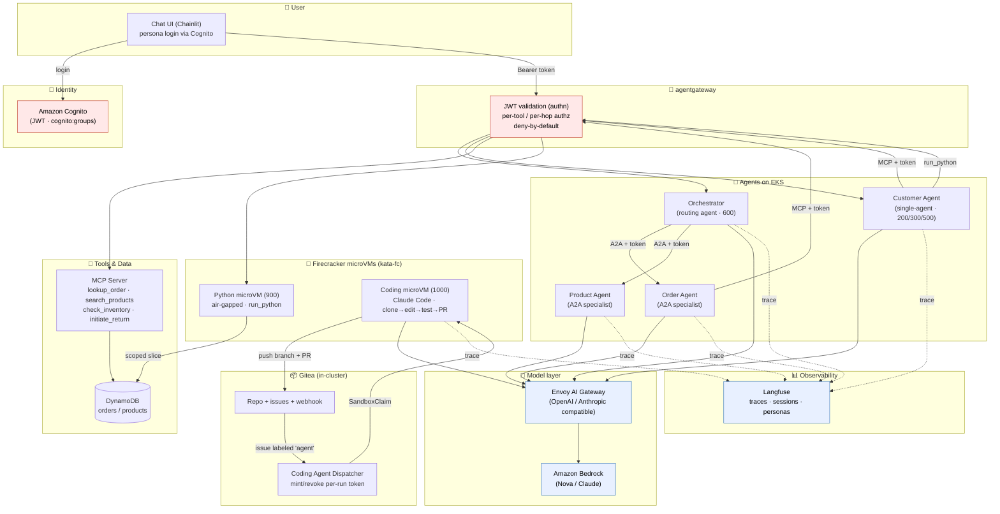
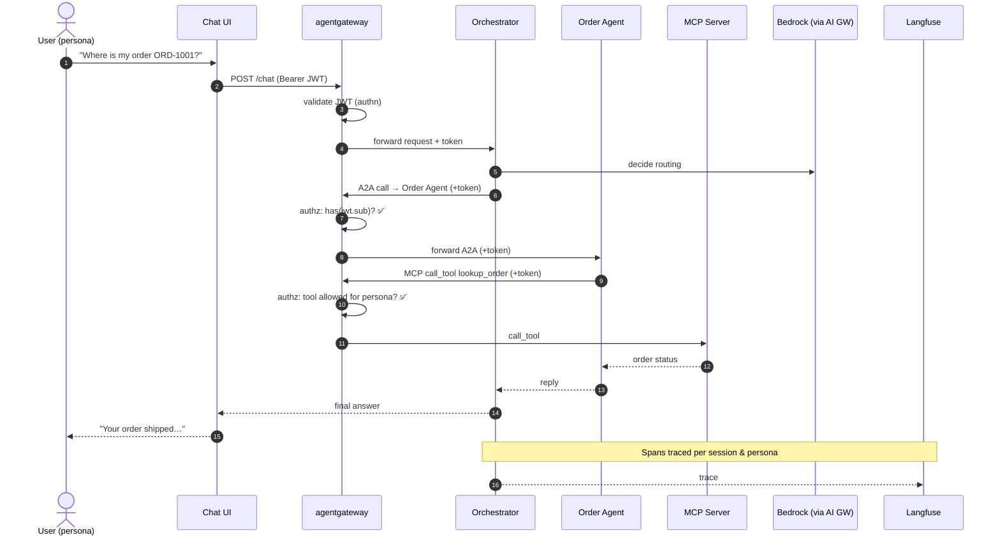
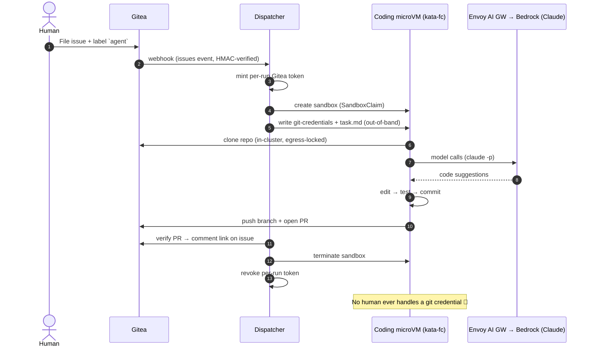
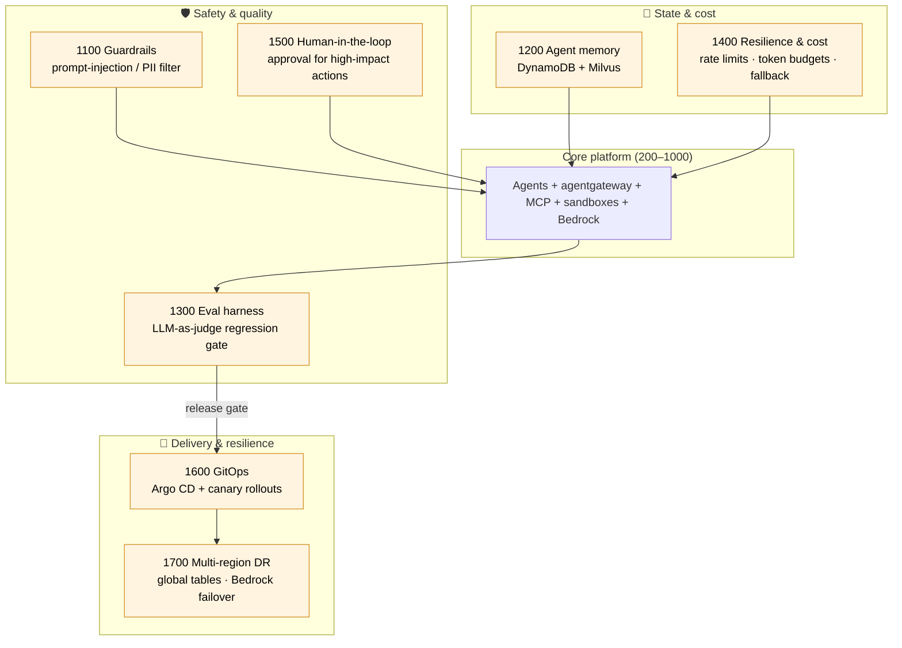

# Workshop Architecture & Flow

Secure AI agents on Amazon EKS — from a single agent to an autonomous coding agent.
Each module builds on the previous one; the diagrams below layer up the same way.

---

## 1. End-to-end architecture

---

## 2. Request flow — multi-agent query (modules 200→800)

---

## 3. Autonomous coding agent — capstone (module 1000)

---

## 4. Advanced / production-hardening modules (1100–1700)

These layer on top of the core stack — safety, memory, evaluation, cost
controls, controlled autonomy, delivery, and resilience.

| Module | Adds | Builds on |
|---|---|---|
| **1100** Guardrails | Bedrock Guardrails on the model path (screens user turns *and* tool results) | AI Gateway seam; untrusted-tool-output threat model |
| **1200** Agent memory | Short-term (DynamoDB) + long-term semantic (Milvus) memory per user/session | 300 session ids, 500 Milvus |
| **1300** Eval harness | LLM-as-judge regression suite over persona scenarios (incl. authz-negative) | 300 traces, 500/700 authz |
| **1400** Resilience & cost | Per-persona rate limits, token budgets, retries, circuit breaking, model fallback | Envoy AI Gateway / agentgateway |
| **1500** Human-in-the-loop | Approval service: agent proposes, human approves, service executes | 500/700 mutating tools, 1000 autonomy |
| **1600** GitOps | Argo CD App-of-Apps + Argo Rollouts canary gated by the 1300 evals | every module's k8s.yaml, 1300 |
| **1700** Multi-region DR | DynamoDB global tables, Route 53 failover, cross-region Bedrock | 1400 fallback, all stateful deps |

### Security themes baked into every layer
- **Identity propagates** across every hop (UI → orchestrator → specialist → MCP / A2A).
- **Deny-by-default authz** at agentgateway; unauthorized tools are *hidden*, not just blocked.
- **Hardware isolation**: untrusted, model-generated code runs in per-execution Firecracker microVMs.
- **Air-gapped sandboxes**: no network, no AWS creds; data injected out-of-band.
- **Short-lived per-run tokens** for the coding agent, auto-revoked.
- **Full observability** via Langfuse traces, grouped by session and persona.
