# Module Architecture & Flow — Secure AI Agents on Amazon EKS

Per-module architecture diagrams with a step-by-step flow explanation for each.
Images live in [`diagrams/png/`](./png) (raster, for slides/social) and
[`diagrams/svg/`](./svg) (vector, crisp at any zoom). Mermaid sources are in
[`diagrams/src/`](./src) — edit those and re-render.

The platform is a progressive build: a single agent (200) hardened step by step
into a secure, observable, multi-agent system with sandboxed autonomy
(200→1000), then production-hardened (1100→1700).

| # | Module | Theme |
|---|---|---|
| [200](#200--strands-agents) | Strands Agents | foundation agent |
| [300](#300--observability-langfuse) | Observability | tracing |
| [500](#500--agent-tools-mcp) | Tools via MCP | capabilities |
| [600](#600--multi-agent-a2a) | Multi-agent A2A | orchestration |
| [700](#700--persona-authz-at-agentgateway) | Persona authz | security |
| [800](#800--multi-agent-identity-propagation) | Identity propagation | security |
| [900](#900--sandboxed-code-execution) | Sandboxed code | isolation |
| [1000](#1000--autonomous-coding-agent) | Autonomous coding | capstone |
| [1100](#1100--guardrails) | Guardrails | safety |
| [1200](#1200--agent-memory) | Agent memory | state |
| [1300](#1300--evaluation-harness) | Eval harness | quality |
| [1400](#1400--resilience--cost-controls) | Resilience & cost | reliability |
| [1500](#1500--human-in-the-loop-approvals) | Human approvals | controlled autonomy |
| [1600](#1600--gitops--progressive-delivery) | GitOps | delivery |
| [1700](#1700--multi-region-dr) | Multi-region DR | resilience |

---

## 200 — Strands Agents

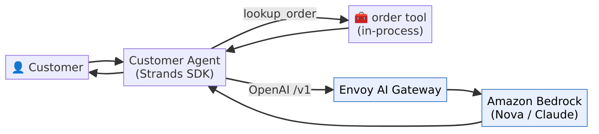

A customer-service agent built with the **Strands SDK**. The agent holds an
in-process `lookup_order` tool and talks to **Amazon Bedrock** through an
OpenAI-compatible **Envoy AI Gateway** (`MODEL_BASE_URL`).

**Flow:** customer message → agent → (optionally calls the order tool) → model
completion via the AI gateway → Bedrock → answer back to the customer. This is
the seam every later module reuses: swapping `MODEL_ID`/`MODEL_BASE_URL` changes
the backing model without touching agent code.

---

## 300 — Observability (Langfuse)

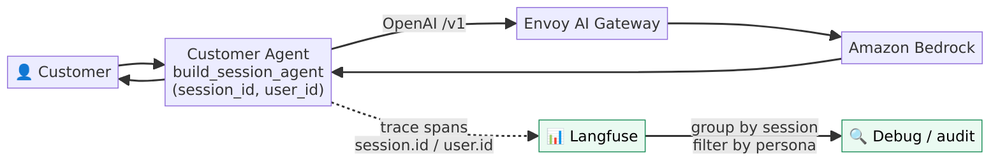

Adds tracing. `build_session_agent(session_id, user_id)` attaches those ids as
Strands **trace attributes** (`session.id` / `user.id`).

**Flow:** same request path as 200, but every step emits spans to **Langfuse**.
Langfuse maps the span attributes onto the trace's `sessionId` / `userId`, so
interactions **group by conversation** and are **filterable by persona** — the
basis for debugging and the later eval harness (1300).

---

## 500 — Agent Tools (MCP)

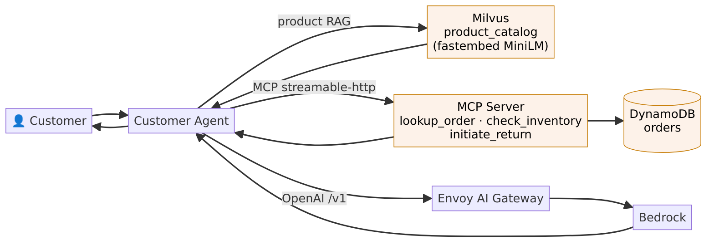

The agent gains real capabilities: product **RAG** over **Milvus**
(`search_products`, fastembed MiniLM) and order tools over the **Model Context
Protocol** (`lookup_order`, `check_inventory`, `initiate_return`) backed by
**DynamoDB**.

**Flow:** the agent picks a tool per the user's intent — Milvus for product
questions, the MCP server for order actions — then composes the tool results
with the model's answer. Tools are granted per user, so the agent's capability
set is exactly what that user is allowed to do.

---

## 600 — Multi-Agent (A2A)

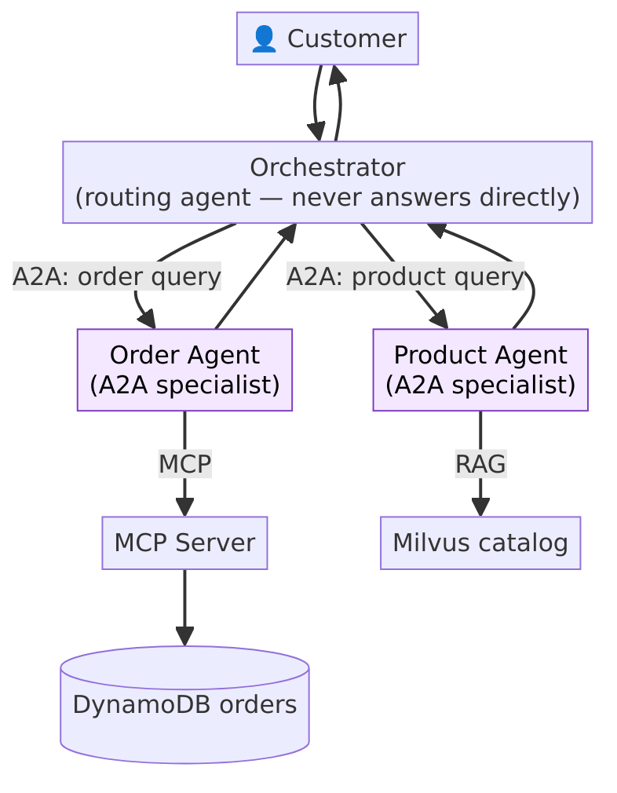

An **orchestrator** that never answers directly — it routes to specialists over
**Agent-to-Agent (A2A)** messaging.

**Flow:** customer → orchestrator decides routing → `ask_order_agent` or
`ask_product_agent` → the specialist does the real work (Order Agent via MCP,
Product Agent via Milvus) → result returns to the orchestrator → customer.
Specialists are stateless, so the orchestrator enriches each query with the
needed context.

---

## 700 — Persona authz at agentgateway

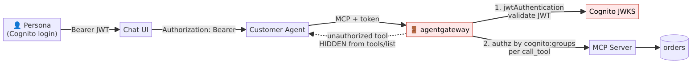

Enforces **which MCP tool each Cognito persona may call**, at the gateway.

**Flow:** the UI forwards the user's Cognito **access token** as
`Authorization: Bearer`; the agent forwards it on each MCP call. **agentgateway**
(1) validates the JWT against Cognito's JWKS, then (2) authorizes each
`call_tool` by the `cognito:groups` claim. An unauthorized tool is **hidden from
`tools/list`** — the agent never even sees it, rather than getting a mid-call
403. A missing/invalid token is rejected 401 before any tool logic.

---

## 800 — Multi-agent identity propagation

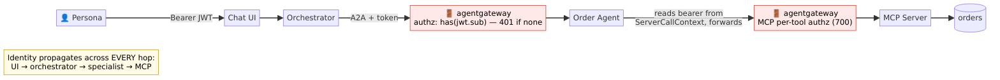

Carries the persona identity through the **whole multi-agent chain** and
authenticates it on the A2A hop.

**Flow:** `UI → orchestrator → [agentgateway A2A] → order-agent →
[agentgateway MCP] → mcp-server`. The orchestrator attaches the bearer on each
A2A call; the order-agent reads the incoming bearer from its A2A
`ServerCallContext` and forwards it on its MCP call. agentgateway authenticates
the persona on the A2A hop (`has(jwt.sub)`, else 401); per-tool authz stays at
the MCP layer (700). The point: identity is enforced on **every hop**, not just
at the front door.

---

## 900 — Sandboxed code execution

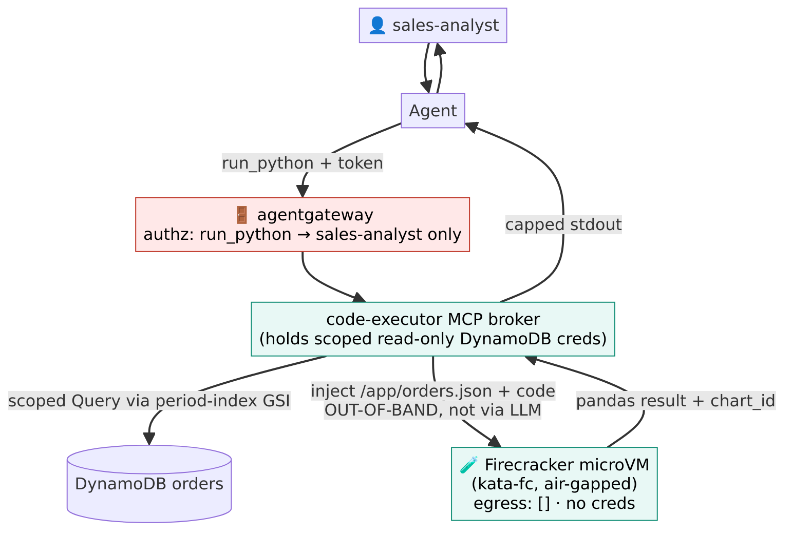

Gives the agent a **`run_python`** tool that runs untrusted, model-generated
code inside a **per-execution Firecracker microVM**.

**Flow:** sales-analyst asks an analytical question → `run_python` →
agentgateway authorizes the tool to the sales-analyst persona → the
**code-executor MCP broker** (which holds scoped read-only DynamoDB creds)
fetches a bounded slice via the `period-index` GSI and injects it plus the code
into an **air-gapped kata-fc microVM** (`egress: []`, no credentials)
**out-of-band — never through the LLM** → pandas runs → capped stdout (and an
out-of-band `chart_id` for any plot) returns to the agent.

---

## 1000 — Autonomous Coding Agent

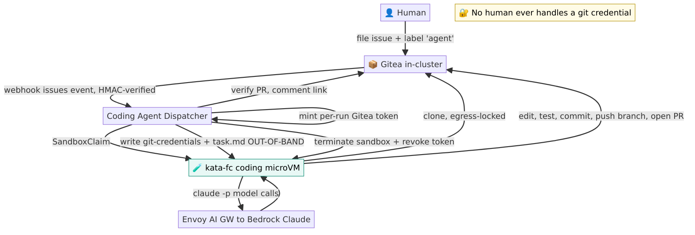

The capstone: a labeled Git issue becomes a PR, fully autonomously.

**Flow:** a human files an issue and labels it `agent` on in-cluster **Gitea** →
the webhook (HMAC-verified) hits the **dispatcher** → the dispatcher mints a
per-run Gitea token and creates a **kata-fc coding microVM**, writing
git-credentials + task.md out-of-band → **Claude Code** inside the sandbox
clones (egress-locked), edits, tests, commits, pushes a branch, and opens a PR,
calling the model through the Envoy AI Gateway → the dispatcher verifies the PR,
comments the link, terminates the sandbox, and revokes the token. **No human
ever handles a git credential.**

---

## 1100 — Guardrails

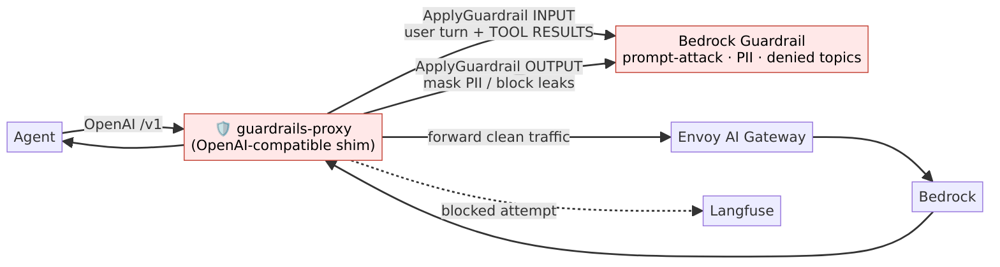

A safety layer on the model path. The **guardrails-proxy** is an
OpenAI-compatible shim: agents point `MODEL_BASE_URL` at it, unchanged.

**Flow:** request → proxy runs **ApplyGuardrail (INPUT)** over the user turn
**and tool results** (the real prompt-injection vector) → if blocked, returns a
safe refusal without calling the model → otherwise forwards to the AI gateway →
Bedrock → proxy runs **ApplyGuardrail (OUTPUT)** to mask PII / catch leaks →
answer. Blocked attempts are logged for the eval harness.

---

## 1200 — Agent memory

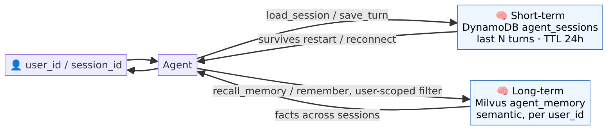

Two tiers of memory. **Short-term**: a rolling transcript in **DynamoDB**
(`agent_sessions`, keyed by `session_id`, 24h TTL) that survives pod restarts
and reconnects. **Long-term**: salient facts in **Milvus** (`agent_memory`),
semantically searchable and **filtered by `user_id`** server-side.

**Flow:** on each turn the agent loads/saves the session window and may call
`recall_memory` / `remember` to read/write durable user facts — so a stated
preference persists across sessions, scoped to that user.

---

## 1300 — Evaluation harness

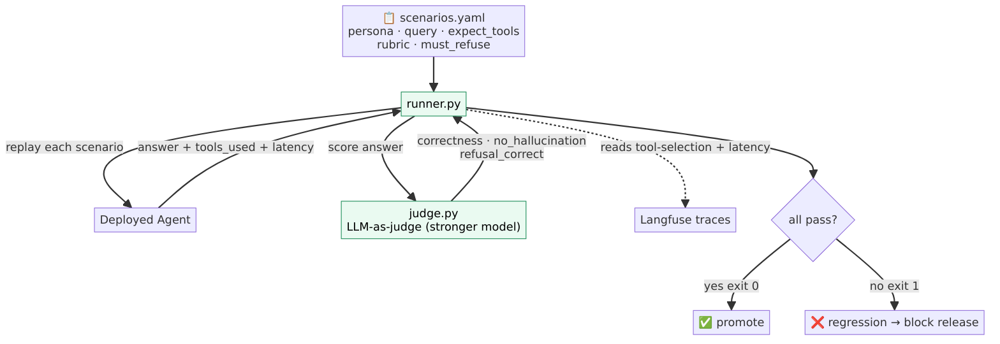

Turns quality into a repeatable, scored gate.

**Flow:** `runner.py` replays each scenario in `scenarios.yaml` against the
deployed agent, captures the answer + tools used + latency, then an
**LLM-as-judge** scores correctness / no-hallucination / refusal-correctness. It
also asserts tool selection and latency (reading Langfuse traces). All scenarios
pass → exit 0 (promote); any regression → exit 1 (block release). Scenarios
include **authz-negative** cases (a sales-analyst must be refused
`initiate_return`) and prompt-injection refusals.

---

## 1400 — Resilience & cost controls

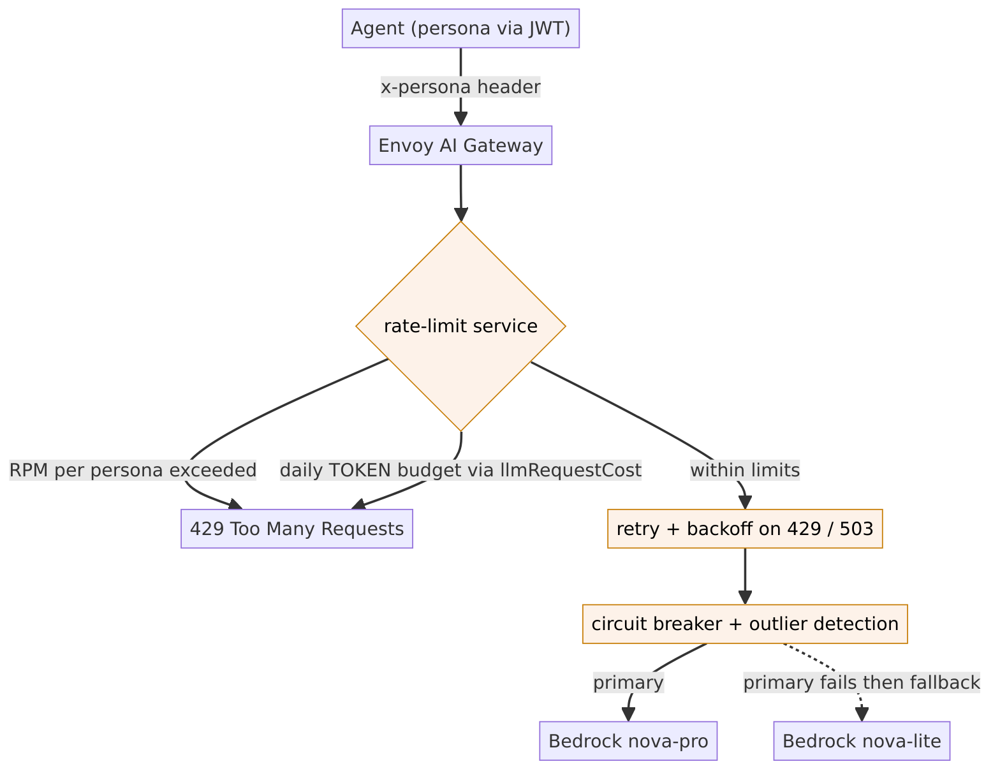

Protects the platform and the bill at the gateway.

**Flow:** each request carries an `x-persona` header derived from the JWT. The
rate-limit service enforces **per-persona RPM** and a **daily token budget**
(via Envoy AI Gateway's `llmRequestCost`, so the budget is denominated in the
thing that costs money). Within limits, requests get **retries + backoff** on
429/503, **circuit breaking + outlier detection**, and a **model fallback**
(nova-pro → nova-lite) when the primary fails.

---

## 1500 — Human-in-the-loop approvals

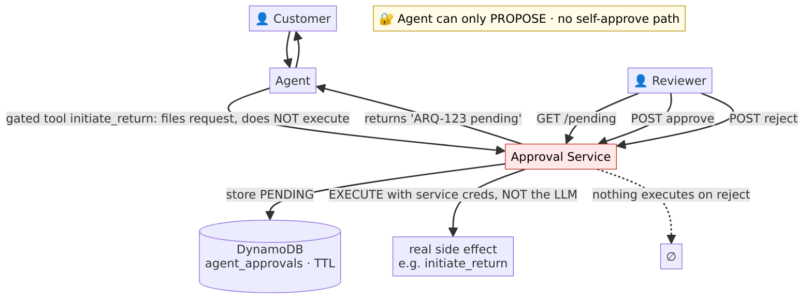

High-impact actions pause for a human. The key safety property: the agent can
only **propose**; a separate service **executes** after approval.

**Flow:** the agent calls a gated tool (e.g. `initiate_return`) which **files an
approval request** (DynamoDB, PENDING) and returns a reference — it does **not**
act. A reviewer lists `/pending` and approves or rejects. On **approve**, the
approval service executes the real action **with its own scoped credentials, not
the LLM's**. On **reject**, nothing executes. There is no self-approve path, so
even a jailbroken agent cannot action it alone.

---

## 1600 — GitOps & progressive delivery

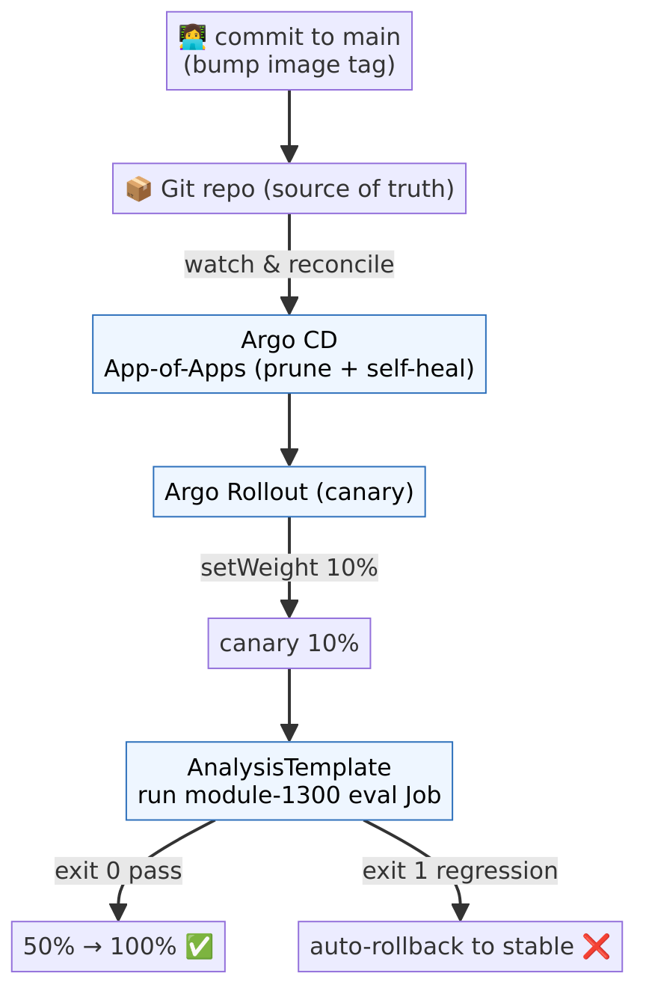

Git becomes the source of truth; releases are canary-gated by the evals.

**Flow:** a commit to `main` (e.g. an image-tag bump) → **Argo CD**
(App-of-Apps, prune + self-heal) reconciles → the **Argo Rollout** shifts 10% of
traffic to the canary → the **AnalysisTemplate** runs the module-1300 eval Job →
exit 0 promotes to 50% → 100%; a regression (exit 1) **auto-rolls-back** to the
stable version. No more hand-run `kubectl apply`.

---

## 1700 — Multi-region DR

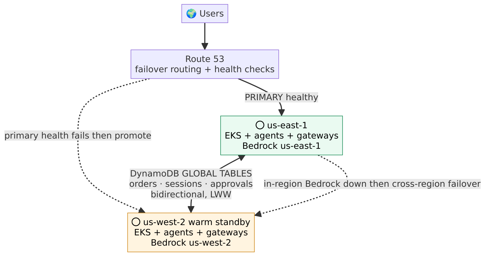

Survives a regional outage with a warm standby.

**Flow:** **Route 53** failover routing with per-region health checks sends
traffic to the healthy **primary** (us-east-1). State lives in **DynamoDB global
tables** (orders, sessions, approvals) replicated bidirectionally to the
**standby** (us-west-2), which runs warm. If in-region Bedrock degrades, the
gateway fails over cross-region (building on 1400); if the whole primary region
fails its health check, Route 53 promotes the standby, which serves from the
replicated state.

---

### Rendering the diagrams

```bash
cd diagrams
# PNG (scale 2) + SVG for every source, via the Mermaid CLI Docker image:
for f in src/*.mmd; do b=$(basename "$f" .mmd)
  docker run --rm -u "$(id -u):$(id -g)" \
    -e PUPPETEER_EXECUTABLE_PATH=/usr/bin/chromium -e HOME=/tmp \
    -v "$PWD":/data minlag/mermaid-cli:10.9.1 \
    -i "/data/src/$b.mmd" -o "/data/png/$b.png" -p /data/puppeteer-config.json -b white -s 2
done
```
